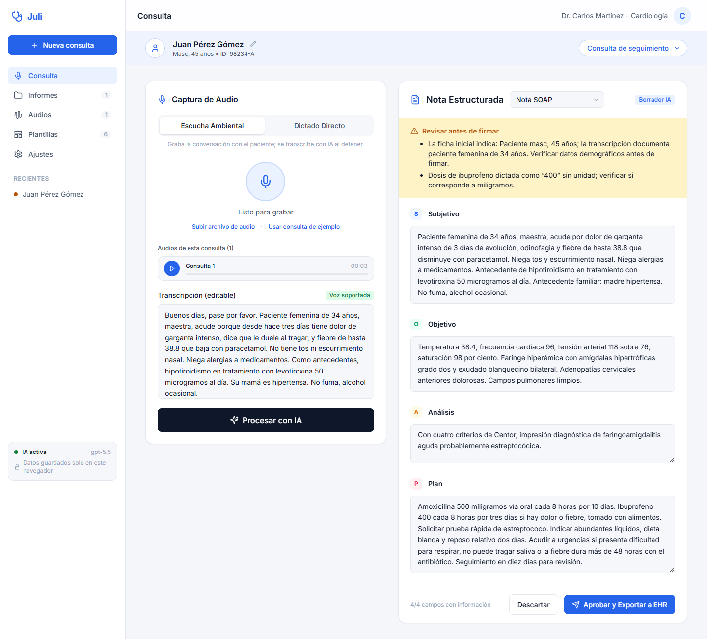
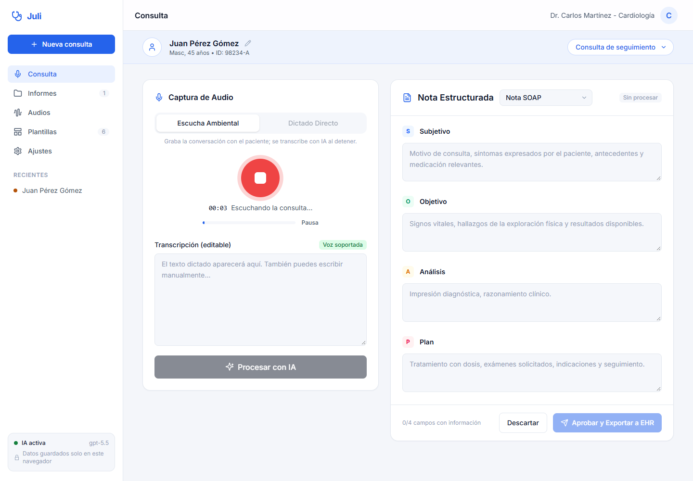
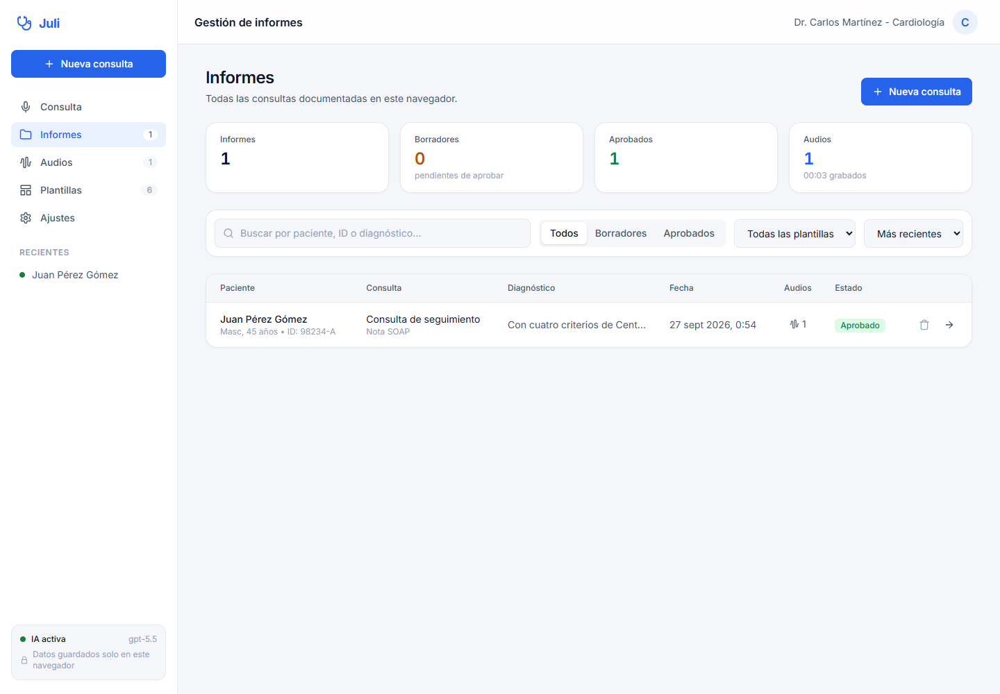
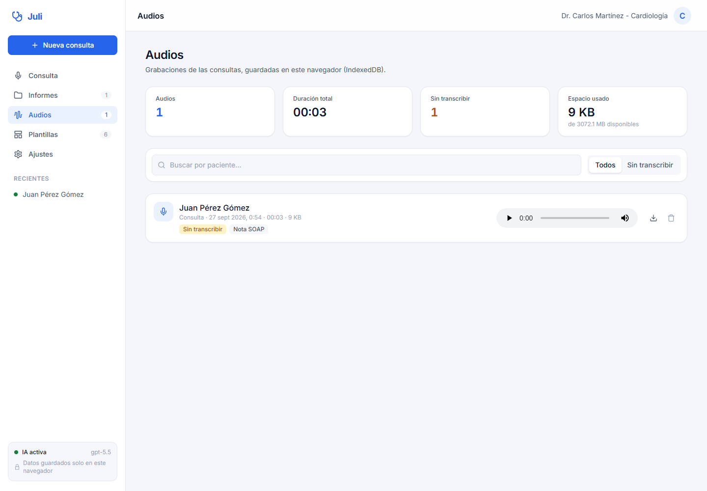
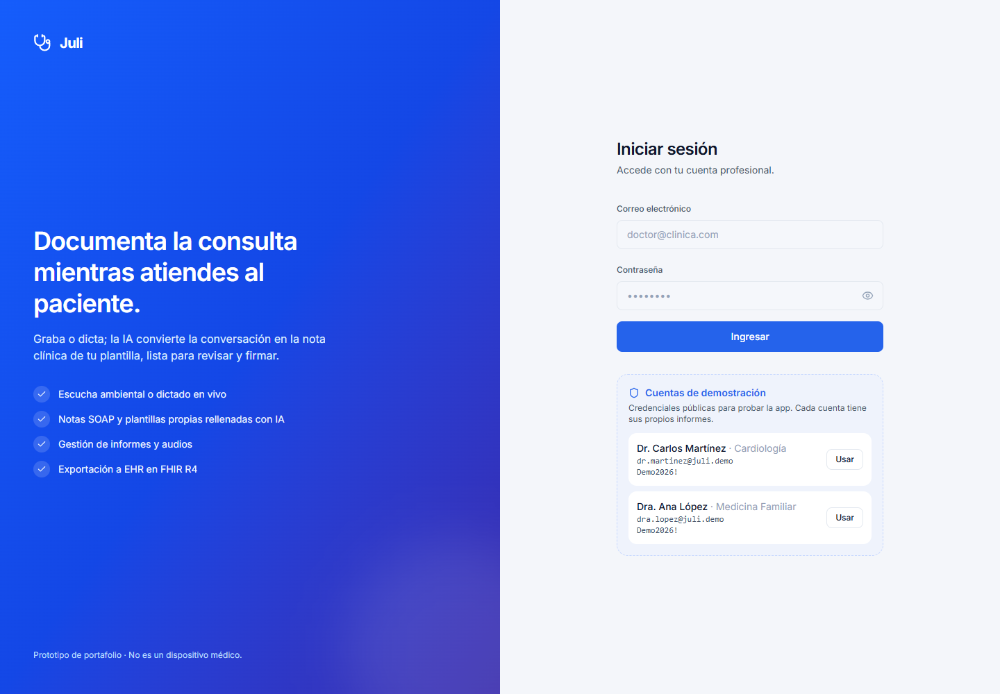
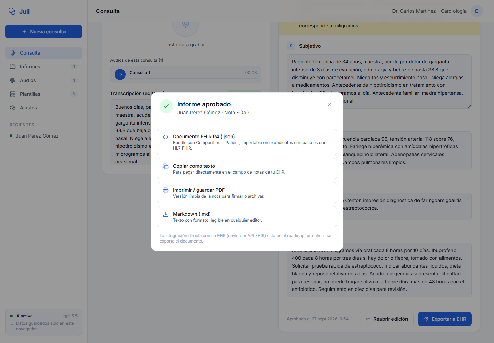
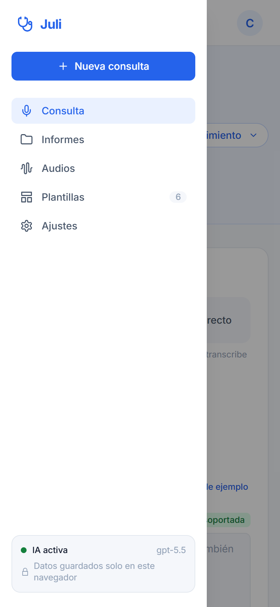
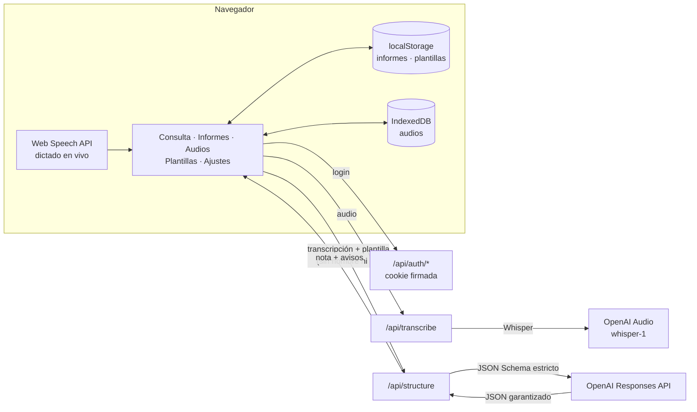

# Juli: notas clínicas con IA a partir de la voz

> Graba o dicta la consulta, revisa la transcripción y obtén la nota médica estructurada en tu plantilla
> (SOAP, historia clínica, evolución, urgencias, receta… o una propia). Gestiona informes y audios desde un panel,
> aprueba y exporta a tu expediente electrónico (FHIR, PDF o texto).

**Demo en vivo:** `https://<tu-app>.vercel.app` · **Stack:** Next.js 16 · React 19 · TypeScript · Tailwind CSS 4 ·
OpenAI API (GPT + Whisper) · Web Speech API · IndexedDB · Zod · Vitest



### Probar la demo

| Cuenta | Correo | Contraseña |
|---|---|---|
| Dr. Carlos Martínez · Cardiología | `dr.martinez@juli.demo` | `Demo2026!` |
| Dra. Ana López · Medicina Familiar | `dra.lopez@juli.demo` | `Demo2026!` |

Las credenciales son públicas a propósito y aparecen en la pantalla de login con un botón *Usar*. Cada cuenta tiene
sus propios informes, audios y plantillas.

---

## El problema

Los médicos dedican una parte enorme de su jornada a documentar. Escribir la nota durante la consulta resta atención
al paciente, y hacerlo después alarga el día. La información ya está en la conversación; lo que falta es convertirla
al formato que exige el expediente.

## La solución

1. **Captura.** Dos modos:
   - **Escucha ambiental:** graba la conversación médico-paciente y la transcribe con **Whisper** de OpenAI (`whisper-1`).
   - **Dictado directo:** el texto aparece en vivo mientras el médico habla (Web Speech API, sin coste de API).
2. **Revisión humana.** La transcripción es editable: los errores de reconocimiento se corrigen antes de llegar a la
   nota.
3. **Procesar con IA.** GPT rellena cada campo de la plantilla elegida. La salida está restringida por un JSON Schema
   generado desde la propia plantilla, así que siempre encaja en ella.
4. **Aprobar y exportar.** El médico edita, aprueba y exporta el informe como documento **FHIR R4**, PDF, texto o
   Markdown.

Lo que no se dijo queda vacío, nunca inventado. Las ambigüedades, dosis incompletas o contradicciones aparecen en un
bloque destacado **"Revisar antes de firmar"**.

## Funcionalidades

| Área | Qué incluye |
|---|---|
| **Consulta** | Datos del paciente y tipo de consulta · grabación con pausa y medidor de nivel · subida de archivos · dictado en vivo · nota editable con secciones S/O/A/P · cambio de plantilla |
| **Informes** | Listado con búsqueda (paciente, ID, contenido de la nota), filtros por estado y plantilla, orden · métricas · estados *Borrador* / *Aprobado* · reapertura de informes aprobados |
| **Audios** | Todas las grabaciones con reproductor, duración, tamaño y estado de transcripción · descargar, re-transcribir o eliminar · uso de almacenamiento |
| **Plantillas** | 6 incluidas + editor de plantillas propias (campos de texto o lista, secciones e instrucciones para la IA) · plantilla predeterminada |
| **Exportación** | Bundle **FHIR R4** (`Composition` + `Patient`) · imprimir / PDF · copiar texto · Markdown |
| **Ajustes** | Perfil del médico · idioma del dictado · código de acceso · copia de seguridad JSON · borrado total |
| **Acceso** | Login con sesión firmada (cookie HttpOnly) · cuentas de demo visibles · datos separados por médico · cierre de sesión |
| **Plataforma** | Modo demo sin claves · código de acceso opcional · rate limit · responsive con menú lateral y modo oscuro |

| Grabando | Gestión de informes | Audios |
|---|---|---|
|  |  |  |

| Login | Exportar a EHR | Móvil |
|---|---|---|
|  |  |  |

## Arquitectura



La idea clave: **una plantilla es datos, no código.** Cada campo se traduce a una propiedad de JSON Schema que se
envía como *structured output* estricto a GPT, y el resultado se valida de nuevo con Zod. Por eso una plantilla
creada por el médico en la interfaz funciona sin tocar el backend.

**Privacidad por diseño.** El servidor no guarda nada. Informes y audios viven en el navegador (localStorage e
IndexedDB). A la IA solo llegan la transcripción, el sexo, la edad y el tipo de consulta: nunca el nombre ni el ID del
paciente. Las respuestas de OpenAI se piden con `store: false`.

Más detalle en [docs/ARCHITECTURE.md](docs/ARCHITECTURE.md) · Endpoints en [docs/API.md](docs/API.md) · Por qué se
eligió cada cosa en [docs/DECISIONS.md](docs/DECISIONS.md).

## Puesta en marcha

Requisitos: Node.js 20+.

```bash
git clone https://github.com/<tu-usuario>/juli.git
cd juli
npm install
cp .env.example .env.local   # opcional: sin claves arranca en modo demo
npm run dev
```

Abre <http://localhost:3000>, entra con una cuenta de demo, pulsa **Usar consulta de ejemplo → Procesar con IA** y
luego **Aprobar y Exportar a EHR**.

> El dictado directo funciona en Chrome, Edge y Safari. La grabación de micrófono requiere `localhost` o HTTPS.

### Variables de entorno

| Variable | Por defecto | Descripción |
|---|---|---|
| `OPENAI_API_KEY` | — | Activa la IA real (transcripción y estructuración) con una sola clave. |
| `OPENAI_MODEL` | `gpt-5.5` | Modelo que rellena la plantilla (`gpt-5.4-mini` si quieres abaratar). |
| `OPENAI_REASONING_EFFORT` | `low` | `minimal` · `low` · `medium` · `high`: latencia vs. exhaustividad. |
| `STT_MODEL` | `whisper-1` | Modelo de transcripción: `whisper-1` (Whisper), `gpt-4o-transcribe` (más preciso), `gpt-4o-mini-transcribe`. |
| `STT_BASE_URL` | `https://api.openai.com/v1` | Otro endpoint compatible con `/audio/transcriptions`, p. ej. Groq (`https://api.groq.com/openai/v1`, Whisper gratis). |
| `STT_API_KEY` | = `OPENAI_API_KEY` | Opcional: clave del proveedor de transcripción si no es OpenAI. |
| `STT_LANGUAGE` | `es` | Idioma del audio. |
| `AUTH_SECRET` | valor de desarrollo | Firma las cookies de sesión. **Obligatorio en producción** (valor aleatorio largo). |
| `AUTH_USERS` | cuentas de demo | JSON con usuarios propios; si se define, el login deja de mostrar credenciales. |
| `ACCESS_CODE` | — | Si se define, solo quien lo introduce en *Ajustes* usa las APIs reales. |
| `DEMO_MODE` | `false` | Fuerza el modo demo. |
| `RATE_LIMIT_PER_MINUTE` | `10` | Peticiones por minuto e IP en cada endpoint. |

## Scripts

| Comando | Qué hace |
|---|---|
| `npm run dev` | Servidor de desarrollo |
| `npm run build` / `npm start` | Build y servidor de producción |
| `npm test` | Tests unitarios y de API (Vitest) |
| `npm run lint` | ESLint |
| `npm run typecheck` | Genera los tipos de rutas y ejecuta `tsc` |

La CI de GitHub Actions ([.github/workflows/ci.yml](.github/workflows/ci.yml)) ejecuta lint, tipos, tests y build en
cada push y PR.

## Tests

Los 65 tests cubren:

- Validez de las plantillas y rechazo de plantillas mal formadas.
- Generación del JSON Schema (campos obligatorios, `additionalProperties: false`, listas frente a texto).
- Validación de la respuesta del modelo: tipos incorrectos o campos extra se rechazan.
- El contrato con OpenAI (modelo, `reasoning.effort`, `json_schema` estricto, `store: false`) con el SDK simulado.
- Negativas del modelo (`refusal`) y respuestas incompletas → errores 422.
- Endpoints: validación, límites de tamaño y formato, modo demo, código de acceso, rate limit y que `/api/status` no
  expone secretos.
- Transcripción con OpenAI y con un proveedor alternativo.
- Informes: borradores vacíos, resumen del paciente, búsqueda sin acentos, diagnóstico principal.
- Exportación FHIR: estructura del Bundle, secciones SOAP y escape de HTML.
- Contexto del encuentro en el prompt, sin identificadores del paciente.
- Autenticación: firma y caducidad de la sesión, tokens manipulados, login correcto e incorrecto, cookie HttpOnly,
  usuarios propios por `AUTH_USERS`, redirecciones del proxy y 401 en la API sin sesión.
- Limpieza de Whisper: segmentos sin voz, alucinaciones conocidas y eco de la pista de vocabulario.

Además se verificó el flujo completo en Chrome con micrófono simulado y **APIs reales** (Groq Whisper + GPT):
1. Login (con error y correcto) y cierre de sesión; datos separados entre las dos cuentas.
2. Datos del paciente, grabación, transcripción y nota SOAP.
3. Aprobación y descarga del FHIR.
4. Segundo informe con otra plantilla.
5. Búsqueda y filtros de informes, página de audios, perfil.
6. Persistencia tras recargar y reproducción del audio guardado.
7. Menú móvil sin scroll horizontal, sin errores de consola.

## Despliegue

Guía paso a paso en [docs/DEPLOYMENT.md](docs/DEPLOYMENT.md). En resumen: importar el repositorio en Vercel, añadir
`OPENAI_API_KEY`, `AUTH_SECRET` (y las variables de Groq si lo usas), y desplegar.

## Estructura

```
src/
├── app/
│   ├── page.tsx                 # consulta (/?id=…)
│   ├── login/                   # inicio de sesión
│   ├── informes/ audios/ plantillas/ ajustes/
│   ├── api/auth/login · logout · me
│   ├── api/status · transcribe · structure
│   └── layout.tsx · globals.css
├── proxy.ts                     # redirige al login sin sesión
├── components/
│   ├── auth/LoginView.tsx
│   ├── shell/AppShell.tsx       # menú lateral + barra superior
│   ├── consult/                 # PatientBar, CapturePanel, NotePanel, ExportDialog
│   ├── pages/                   # Informes, Audios, Plantillas, Ajustes
│   ├── audio/AudioPlayer.tsx    # reproductor desde IndexedDB
│   └── TemplateEditor.tsx · ui/Icon.tsx
└── lib/
    ├── auth/                    # usuarios de demo y sesión firmada (HMAC)
    ├── ai/                      # prompt, GPT, transcripción (+ limpieza de Whisper), demo
    ├── templates/               # tipos, plantillas, JSON Schema, exportación de texto
    ├── reports/                 # modelo de informe y utilidades
    ├── export/fhir.ts           # Bundle FHIR R4
    ├── client/                  # store (contexto), IndexedDB, grabación, dictado, fetch
    └── config.ts · http.ts · rate-limit.ts
tests/                           # Vitest
docs/                            # arquitectura, API, despliegue, decisiones, capturas
```

## Roadmap

- [ ] Registro de médicos (base de datos, contraseñas con hash) y almacenamiento en servidor cifrado.
- [ ] Envío directo al EHR mediante API FHIR (hoy se exporta el documento).
- [ ] Subida directa del audio a almacenamiento (sin el límite de 4 MB) y transcripción por fragmentos.
- [ ] Diarización (médico / paciente) con `gpt-4o-transcribe-diarize`.
- [ ] Firma electrónica del informe aprobado.
- [ ] Rate limit distribuido (Upstash Redis) y observabilidad.
- [ ] Conjunto de evaluación con transcripciones anotadas para medir la precisión por campo.

## Aviso

Juli es un prototipo con fines demostrativos. **No es un dispositivo médico** y no sustituye el juicio
clínico: toda nota generada debe ser revisada y validada por el profesional responsable. Para su uso con datos reales
de pacientes se requieren acuerdos de tratamiento de datos con los proveedores de IA y el cumplimiento de la normativa
aplicable (p. ej. NOM-004/NOM-024 en México, RGPD en la UE, HIPAA en EE. UU.).
