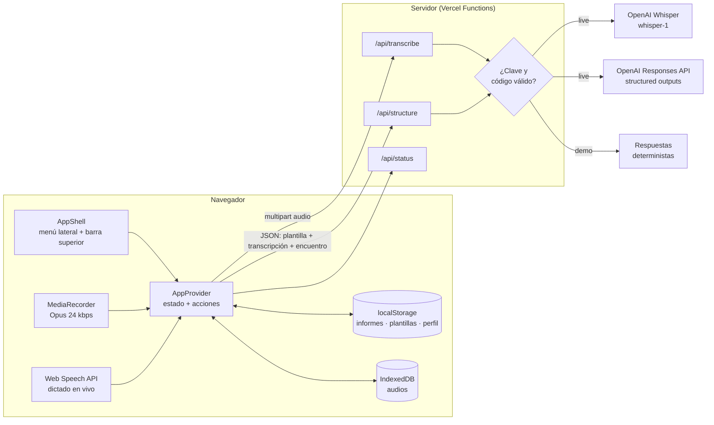
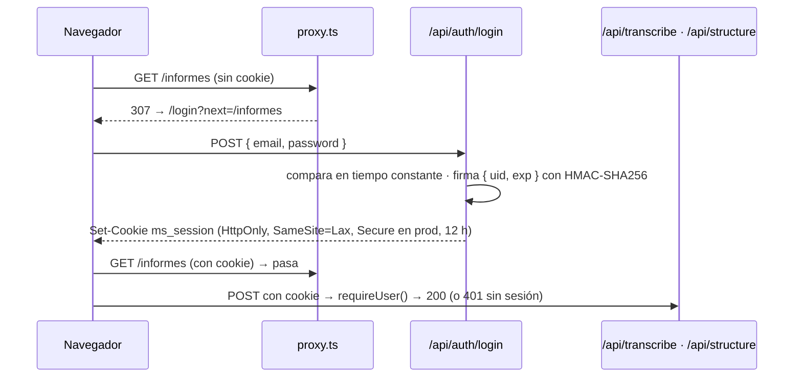
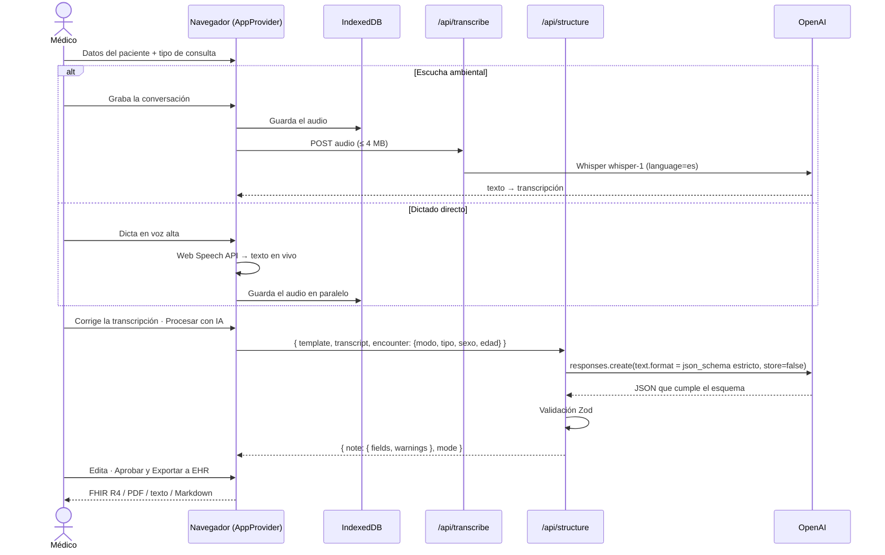

# Arquitectura

MediScribe AI es una aplicación **Next.js (App Router)** desplegada como un único proyecto:
- una interfaz React con cinco vistas;
- tres endpoints serverless (`/api/*`) que actúan como *backend-for-frontend*. Las claves de API viven solo en el
  servidor.

## Vista general



## Vistas

| Ruta | Vista | Contenido |
|---|---|---|
| `/login` | Inicio de sesión | Formulario y cuentas de demo con botón *Usar*. Única página accesible sin sesión. |
| `/?id=<informe>` | Consulta | Barra del paciente, captura (escucha ambiental / dictado), transcripción, nota estructurada, aprobar y exportar. Sin `id` crea un borrador nuevo. |
| `/informes` | Gestión de informes | Métricas, búsqueda, filtros por estado y plantilla, tabla (tarjetas en móvil). |
| `/audios` | Audios | Reproductor, metadatos, estado de transcripción, re-transcribir, descargar, eliminar, uso de almacenamiento. |
| `/plantillas` | Plantillas | Incluidas y propias; duplicar, editar, eliminar, predeterminar, usar en consulta. |
| `/ajustes` | Ajustes | Perfil, idioma del dictado, código de acceso, estado del servicio, copia de seguridad, borrado. |

## Autenticación



- **Sesión sin estado**: la cookie lleva `base64url({uid, exp}).firma`. Se verifica con `AUTH_SECRET`, sin base de
  datos.
- **Doble control**: `proxy.ts` hace una comprobación rápida para las páginas. Cada endpoint de IA vuelve a
  verificar la sesión con `requireUser()`, como recomienda la guía de Next.js, así que la API no depende del proxy.
- **Datos por médico**: el `AppProvider` usa el `id` del usuario como espacio de nombres en `localStorage`
  (`mediscribe:<uid>:reports`…) y se vuelve a montar al cambiar de usuario.
- **Usuarios**: dos cuentas de demo con credenciales públicas. `AUTH_USERS` las reemplaza por usuarios propios y
  entonces el login deja de mostrarlas.

## Flujo de una consulta



## Modelo de datos (cliente)

```ts
Report {
  id, createdAt, updatedAt,
  status: "borrador" | "aprobado", approvedAt?,
  patient: { name, sex, age, externalId },
  consultationType, captureMode: "ambiental" | "dictado",
  template,            // copia: el informe no cambia si se edita la plantilla
  transcript, note: { fields, warnings },
  generatedAt?, generationMode?: "live" | "demo",
  audioIds: string[]
}
AudioMeta { id, reportId, createdAt, durationSec, mimeType, size, name,
            source: "grabacion" | "archivo", transcribedBy: "servidor" | "navegador" | null }
```

- Informes, plantillas propias y perfil → `localStorage` (texto, pequeño).
- Binarios de audio → IndexedDB (`mediscribe/audios`), referenciados por `AudioMeta.id`.
- Las acciones asíncronas (transcribir, procesar) viven en el `AppProvider`. El estado *ocupado* y los errores se
  guardan por informe, así que siguen su curso aunque el médico navegue a otra vista.
- Los borradores vacíos (sin paciente, transcripción, audio ni nota) se descartan automáticamente al abrir una
  consulta nueva.

## Módulos

| Ruta | Responsabilidad |
|---|---|
| `src/lib/templates/*` | Modelo de plantilla (Zod), 6 plantillas incluidas, plantilla → JSON Schema, validador del resultado, exportación a texto / Markdown. |
| `src/lib/reports/*` | Tipos de informe/audio/perfil y utilidades (nota vacía, búsqueda, resumen del paciente, formato). |
| `src/lib/export/fhir.ts` | Informe → Bundle FHIR R4 `document` (Composition + Patient) con secciones en XHTML escapado. |
| `src/lib/ai/prompt.ts` | Prompt de sistema estable y mensaje de usuario con plantilla, contexto del encuentro y transcripción. |
| `src/lib/ai/structure.ts` | Llamada a la Responses API de OpenAI, errores tipados, `refusal` y respuestas incompletas. |
| `src/lib/auth/*` | Usuarios (demo o `AUTH_USERS`), sesión firmada con HMAC, lectura de la cookie. |
| `src/proxy.ts` | Redirige al login las páginas sin sesión (y saca del login a quien ya entró). |
| `src/lib/ai/transcribe.ts` | Transcripción con Whisper y limpieza de la salida: segmentos sin voz, alucinaciones conocidas, eco de la pista. |
| `src/lib/ai/demo.ts` | Transcripción y notas de ejemplo para el modo demo. |
| `src/lib/client/store.tsx` | `AppProvider`: estado global, persistencia y acciones. |
| `src/lib/client/audio-db.ts` | Envoltorio mínimo de IndexedDB para los audios. |
| `src/lib/client/use-recorder.ts` | Hook de grabación (MediaRecorder, pausa, medidor, límite de 20 min). |
| `src/lib/client/use-dictation.ts` | Hook de dictado en vivo (Web Speech API con reanudación automática tras silencios). |
| `src/components/shell/AppShell.tsx` | Menú lateral (fijo en escritorio, cajón en móvil), recientes, estado del servicio, barra superior. |
| `src/components/consult/*` | Barra del paciente, panel de captura, panel de la nota, diálogo de exportación. |
| `src/components/pages/*` | Vistas de informes, audios, plantillas y ajustes. |
| `src/app/api/*/route.ts` | Endpoints HTTP (ver [API.md](API.md)). |

## Plantillas dinámicas → salida garantizada

Una plantilla es **datos, no código**. Cada campo (`key`, `label`, `hint`, `type`) se traduce a una propiedad de JSON
Schema:

```jsonc
{
  "type": "object",
  "properties": {
    "fields": {
      "type": "object",
      "properties": {
        "subjetivo": { "type": "string", "description": "Subjetivo: Motivo de consulta, síntomas…" },
        "diagnosticos": { "type": "array", "items": { "type": "string" }, "description": "…" }
      },
      "required": ["subjetivo", "diagnosticos"],
      "additionalProperties": false
    },
    "warnings": { "type": "array", "items": { "type": "string" } }
  },
  "required": ["fields", "warnings"],
  "additionalProperties": false
}
```

Ese esquema se envía en `text.format` con `strict: true`, así que la API de OpenAI **garantiza** que la respuesta es
JSON válido con exactamente esos campos. El servidor vuelve a validar con Zod. El `hint` de cada campo cumple dos
funciones: es la instrucción para la IA y el *placeholder* que ve el médico. La sección (`"S · Subjetivo"`) define
el agrupamiento visual con la insignia de color S/O/A/P.

## Seguridad clínica en el diseño

- **No inventar**: el prompt exige dejar vacío lo que no se menciona. La UI marca esos campos como *no referido*.
- **`warnings`**: canal explícito para ambigüedades, dosis incompletas o alergias que chocan con la prescripción.
- **Transcripción editable** antes de estructurar; **nota editable** antes de aprobar.
- **Aprobación explícita**: un informe aprobado queda en solo lectura; editarlo requiere *Reabrir edición*.
- **Inyección de prompt**: la transcripción va dentro de `<transcripcion>` y el prompt indica tratarla como datos.

## Privacidad

- El servidor **no persiste nada**: no hay base de datos. Audio y texto solo se reenvían a OpenAI.
- Las respuestas se piden con `store: false`.
- **Minimización de datos**: a la IA solo llegan la transcripción, el sexo, la edad y el tipo de consulta. El nombre
  y el ID del paciente se quedan en el navegador; se usan solo en la UI y en la exportación.
- `/api/status` expone solo el modo y el nombre del modelo, nunca claves.

> Para uso real con pacientes se requeriría:
> - acuerdos de tratamiento de datos (BAA/DPA) con los proveedores;
> - autenticación de usuarios;
> - cifrado del almacenamiento local o un backend cifrado;
> - auditoría.

## Modo demo y control de costos

`resolveMode()` decide por petición:

1. `DEMO_MODE=true` → demo.
2. Falta la clave del proveedor → demo.
3. `ACCESS_CODE` definido y la cabecera `x-access-code` no coincide → demo.
4. En otro caso → llamadas reales.

El dictado directo funciona siempre de verdad, incluso en demo, porque usa el reconocimiento de voz del navegador.

## Límites conocidos

| Límite | Motivo | Mitigación |
|---|---|---|
| Audio ≤ 4 MB por petición | Vercel limita el cuerpo de las funciones a ~4.5 MB | Grabación a 24 kbps (~20 min caben); roadmap: subida directa a storage |
| Datos solo en un navegador | Decisión de privacidad del MVP | Copia de seguridad JSON en Ajustes; roadmap: backend cifrado |
| Dictado directo depende del navegador | Web Speech API no existe en Firefox; Chrome la procesa en servidores de Google | La pestaña se desactiva si no hay soporte; escucha ambiental como alternativa |
| Rate limit por instancia | El mapa vive en memoria de cada función | Suficiente para un MVP; roadmap: Upstash Redis |
| Cuentas de demo públicas | Es un portafolio: cualquiera debe poder entrar | Rate limit por IP, límite de gasto en OpenAI, `AUTH_USERS` o `ACCESS_CODE` para cerrarla |
| Whisper alucina ante el silencio | Comportamiento conocido del modelo | `verbose_json` + filtro por `no_speech_prob`, lista de frases típicas y detección del eco de la pista |
| Sin diarización | Whisper no distingue hablantes | El prompt indica que es una conversación y pide separar lo subjetivo de lo objetivo |
